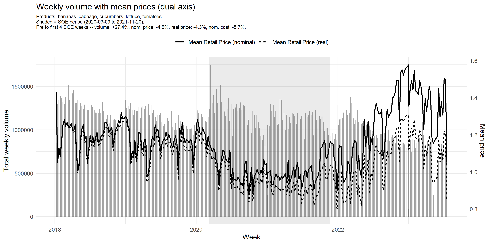
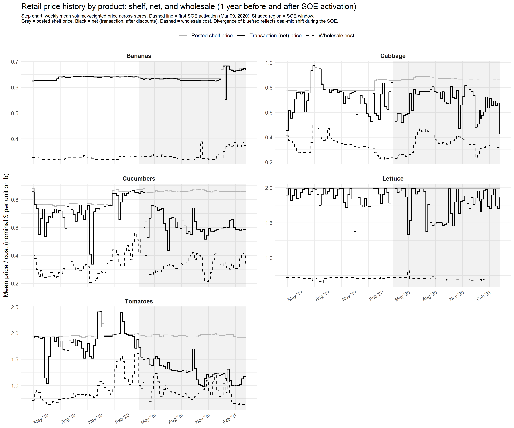
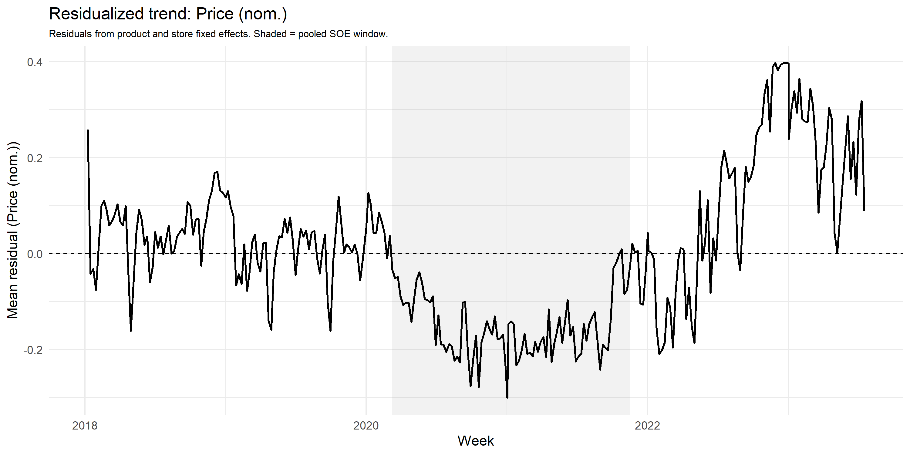
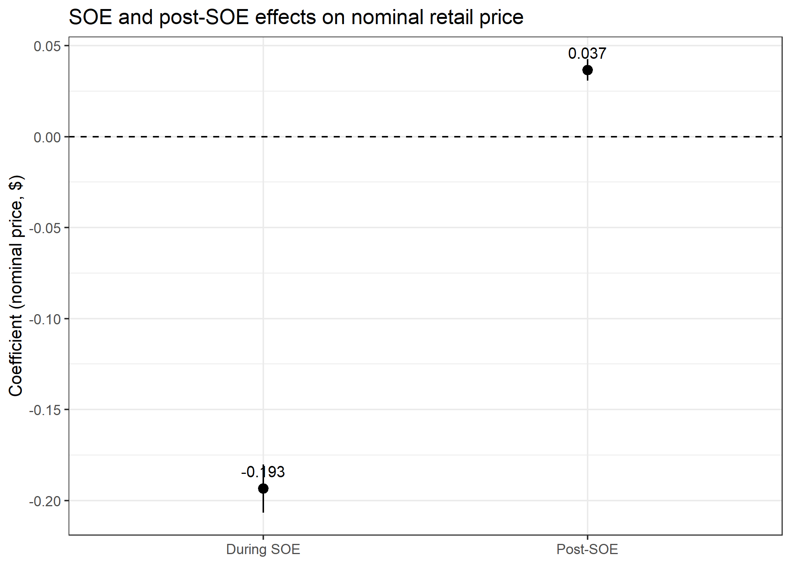
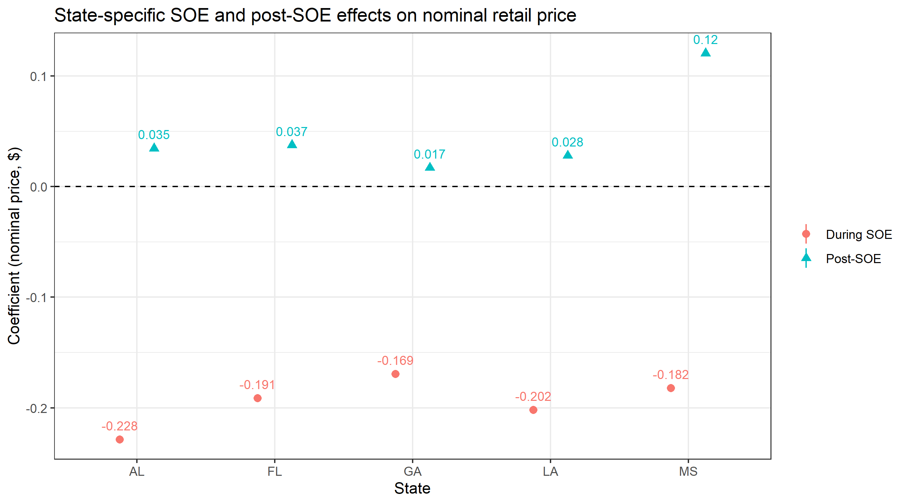
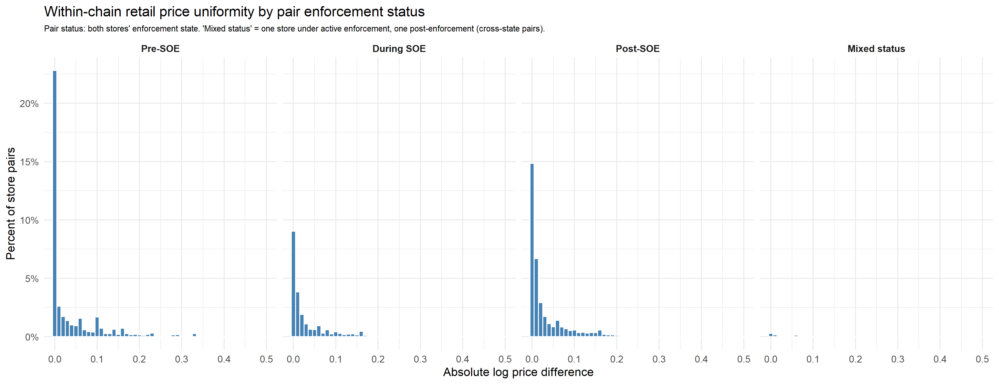
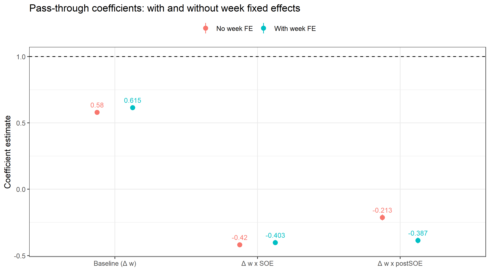
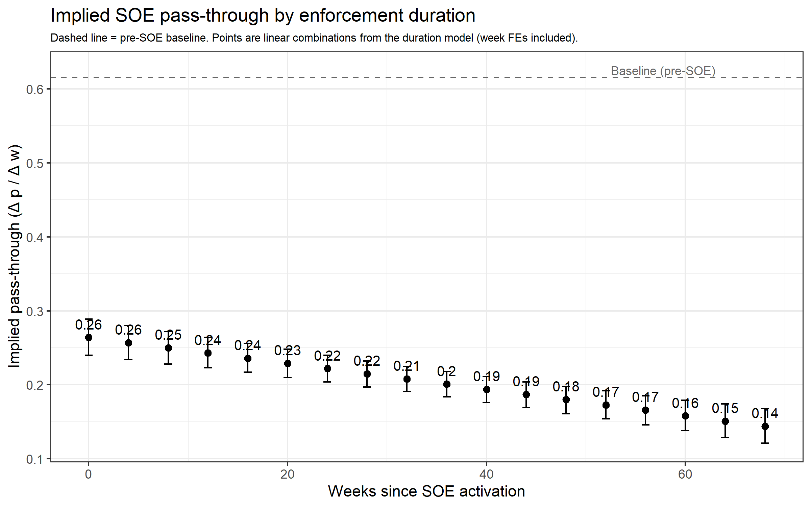
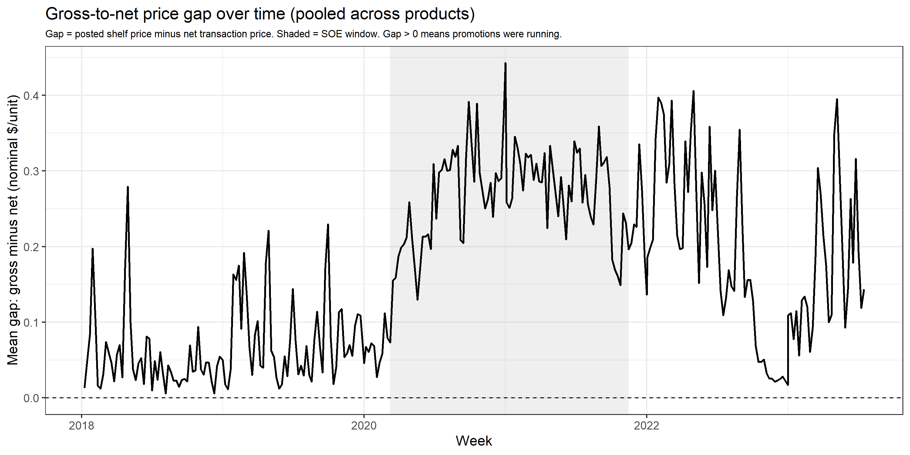

# Food Retailer Pricing Behavior Under Anti-Price Gouging Laws: Evidence from Wholesale and Retail Scanner Data

**Chenarides, Richards, and Dong**

Replication code for the analysis of anti-price gouging (APG) laws and grocery retail pricing during COVID-19 state-of-emergency (SOE) periods. The analysis uses a store-product-week panel of scanner data for five fresh-produce items across five Southeastern states, linking retail transaction prices, posted shelf prices, promotional activity, quantities, and wholesale acquisition costs within the same point-of-sale system.

---

## Quick Start

Open `pg_project.Rproj` in RStudio (sets the working directory automatically), then:

```r
source("code/run_all.R")
```

All tables and figures are written to `tables_latex/` and `figures/`. See [Script Guide](#script-guide) below for what each script produces.

---

## Data and Empirical Setting

**Products:** bananas (PLU 4011), cabbage (PLU 4069), cucumbers (PLU 4062), lettuce (UPC 7143001065), tomatoes (PLU 4087)

**States:** Alabama, Florida, Georgia, Louisiana, Mississippi

**Retailers:** three regional grocery chains (one retailer from original dataset is excluded: closed mid-sample)

**Period:** January 2018 – July 2023 (weekly)

**SOE window:** March 2020 – mid-2021 (varies by state)

The figure below shows weekly retail volume and prices across all products and stores. The shaded region marks the pooled SOE window.



---

## Variable Construction

The primary retail price is `p_ist_net` — the volume-weighted transaction price (net of promotional discounts). This is the consumer-relevant price and matches the paper's estimating equations. The posted shelf price `p_ist_gross` is retained for robustness and for the promotional expansion mechanism.

Net and gross prices diverge during the SOE because the share of transactions completed at a promotional price rose from ~8% pre-SOE to ~30% during the SOE. The figure below shows the gross price (grey), net price (black), and wholesale cost (dashed) for each product in the year before and after SOE activation.



**Key variables:**

| Variable | Description |
|----------|-------------|
| `p_ist` | Primary retail price (`p_ist_net`: volume-weighted transaction price) |
| `p_ist_gross` | Volume-weighted posted shelf price |
| `p_ist_net` | Volume-weighted net price (after promotional discounts) |
| `w_ist` | Volume-weighted wholesale unit cost |
| `margin_nom` | Nominal dollar margin = `p_ist` − `w_ist` |
| `SoE` | 1 if APG enforcement active in state s, week t |
| `postSoE` | 1 for weeks after SOE deactivation |
| `Dur_st` | Weeks since SOE activation (0 outside SOE) |
| `k_start` | Event time relative to SOE start |
| `share_on_sale` | Fraction of transactions at a promotional price |

**Subscripts:** i = store, j = product, s = state, t = week

---

## Descriptive Evidence

The residualized price trend below removes product and store fixed effects and plots the weekly mean residual. The SOE window is shaded.



Period means for price, cost, margin, and volume by product are in `tables_latex/04_tab_period_means_nominal.tex`.

---

## Empirical Model and Results

### Price and Margin Level Regressions

Specification:

```
P_ist = α + β₁·SOE_st + β₂·postSOE_st + γ_j + δ_i + ε_ist
```

Fixed effects: product (γ_j) and store (δ_i). Clustering: store level.



State heterogeneity in price effects:



---

## Mechanisms

### Mechanism 1: Consant Retail Prices

Within-chain price uniformity is measured as the mean absolute log price difference across store pairs, by retailer-product-week. The regression tests whether uniformity changed during and after the SOE.



### Mechanism 2: Variation in Pass-Through

Specification:

```
ΔP_ist = α + β₁·Δw_ist + β₂·(Δw_ist × SOE_st) + β₃·(Δw_ist × postSOE_st)
         + γ_j + δ_i + τ_t + ε_ist
```

The preferred specification includes week fixed effects (τ_t). The identifying variation — Δw × SOE — varies across stores within a week and is not absorbed by week FEs.



The duration extension asks how many weeks it takes for pass-through to return to baseline after SOE activation:



### Mechanism 3: Countercyclical Promotional Pricing

Retailers use promotional discounts to price discriminate between price-elastic shoppers (deal hunters) and price-inelastic shoppers (who pay the shelf price). If APG laws constrain posted prices, retailers may adjust deal frequency or depth as an alternative margin-management channel.

The gross-to-net price gap — the average per-unit promotional discount — widens during the SOE if deal activity increased:



Promotional intensity (share on sale and discount depth) regressions are in `tables_latex/22_tab_promo_intensity.tex`. Within-store price dispersion regressions (do different shoppers pay different prices on the same day?) are in `tables_latex/23_tab_price_dispersion.tex`. IV pass-through using distance-weighted cross-market costs is in `tables_latex/24_tab_iv_passthrough.tex`.

---

## Script Guide

Scripts are called in order by `run_all.R`. The table below maps each script to the paper section it serves.

| Script | Paper section | Purpose | Key outputs |
|--------|--------------|---------|-------------|
| `00_read_in_data.R` | — | Pull product tables from SQL; assemble `panel_upc_week` | `panel_upc_week` in memory |
| `01_price_sensitivity_diagnostic.R` | Variable Construction (diagnostic) | Compare `p_ist_net` vs `p_ist_gross`; step charts by product | `diag_01`–`diag_08` figures |
| `02_build_panel.R` | Variable Construction | CPI deflation, SOE timing, first differences, trimming | `panel_est`, `save_tex()` |
| `03_descriptive_tables.R` | Results: Descriptive Evidence; Incidence of Price Gouging | Coverage tables, period means, flagged-weeks | Tables 01–07, Figs 01–03 |
| `04_residual_plots.R` | Results: Descriptive Evidence | Residualized trend plots by pool/state/product | Figs 04–07 |
| `05_regressions.R` | Empirical Model; Results: Retail Prices; Markups | Price and margin level regressions | Tables 08–11, Figs 08–11 |
| `06_uniform_pricing.R` | Mechanisms: Mechanism 1 (Constant Retail Prices) | Within-chain price uniformity | Tables 15–20, Figs 14–18 |
| `07_passthrough.R` | Mechanisms: Mechanism 2 (Variation in Pass-Through) | Pass-through regressions + duration extension | Tables 12–14, Figs 12–13 |
| `08_demand_rotation.R` | Mechanisms: Mechanism 3 (Countercyclical Pricing) | Promo intensity, price dispersion, IV pass-through | Tables 21–24, Figs 19–21 |

### Global flags (`run_all.R`)

| Flag | Default | Effect |
|------|---------|--------|
| `SAVE_OPTIONAL_PLOTS` | `TRUE` | By-state and by-product residual trend plots |
| `RETAILERS_KEEP` | `c(2, 3, 5)` | Retailers included (4 excluded) |
| `RUN_DUR_EXTENSION` | `TRUE` | Pass-through duration extension |
| `SAVE_CSV` | `FALSE` | Also write intermediate CSVs alongside LaTeX tables |

---

## Output Inventory

### Tables (`tables_latex/`)

| File | Section | Content |
|------|---------|---------|
| `00_tab_summary_stats.tex` | Results: Summary Table | Full sample |
| `01_tab_decadata_summary.tex` | Results: Descriptive Evidence | Coverage by year |
| `02_tab_decadata_summary_wide.tex` | Results: Descriptive Evidence | Coverage by year × retailer × state |
| `03_tab_product_coverage.tex` | Results: Descriptive Evidence | Coverage and sales by product |
| `04_tab_period_means_nominal.tex` | Results: Descriptive Evidence | Period means: nominal price, cost, margin, volume |
| `05_tab_period_means_real.tex` | Results: Descriptive Evidence | Period means: real prices (supplementary) |
| `06_tab_flagged_weeks_all.tex` | Results: Incidence of Price Gouging | APG flag rates across thresholds |
| `07_tab_flagged_weeks_T25.tex` | Results: Incidence of Price Gouging | Flag rates at 25% threshold by product |
| `08_tab_price_reg.tex` | Results: Retail Prices | Price level regressions |
| `09_tab_price_reg_state_heterog.tex` | Results: Retail Prices | Price effects by state |
| `10_tab_margin_reg.tex` | Results: Markups | Margin level regressions |
| `11_tab_margin_reg_state_heterog.tex` | Results: Markups | Margin effects by state |
| `12_tab_passthrough_reg.tex` | Mechanisms: Mechanism 2 (Variation in Pass-Through) | Pass-through: no week FE vs week FE |
| `13_tab_passthrough_duration.tex` | Mechanisms: Mechanism 2 (Variation in Pass-Through) | Pass-through duration extension |
| `14_tab_passthrough_implied_soe.tex` | Mechanisms: Mechanism 2 (Variation in Pass-Through) | Implied SOE pass-through at selected durations |
| `15_tab_uniformity_summary_retail.tex` | Mechanisms: Mechanism 1 (Constant Retail Prices) | Retail log-diff summary by period |
| `16_tab_uniformity_summary_wholesale.tex` | Mechanisms: Mechanism 1 (Constant Retail Prices) | Wholesale log-diff summary by period |
| `17_tab_uniformity_retail.tex` | Mechanisms: Mechanism 1 (Constant Retail Prices) | Uniformity regressions: retail |
| `18_tab_uniformity_wholesale.tex` | Mechanisms: Mechanism 1 (Constant Retail Prices) | Uniformity regressions: wholesale |
| `19_tab_uniformity_heterog_retail.tex` | Mechanisms: Mechanism 1 (Constant Retail Prices) | Retailer heterogeneity: retail uniformity |
| `20_tab_uniformity_heterog_wholesale.tex` | Mechanisms: Mechanism 1 (Constant Retail Prices) | Retailer heterogeneity: wholesale uniformity |
| `21_tab_gross_price_stability.tex` | Mechanisms: Mechanism 3 (Countercyclical Pricing) |  |
| `22_tab_promo_intensity.tex` | Mechanisms: Mechanism 3 (Countercyclical Pricing) | SOE effect on share on sale and discount depth |
| `23_tab_extensive_intensive.tex` | Mechanisms: Mechanism 3 (Countercyclical Pricing) | SOE effect on within-store price dispersion |
| `24_tab_gross_net_gap.tex` | Mechanisms: Mechanism 3 (Countercyclical Pricing) | SOE effect on gross-to-net price gap |
| `25_tab_category_price_promo.tex` | Mechanisms: Mechanism 3 (Countercyclical Pricing) |  |
| `26_tab_category_decomp.tex` | Mechanisms: Mechanism 3 (Countercyclical Pricing) | IV pass-through: OLS vs demand rotation IV |

### Figures (`figures/`)

| File | Section | Content |
|------|---------|---------|
| `diag_06_cost_series.png` | Variable Construction (diagnostic) | Gross price, net price, wholesale cost over time |
| `diag_08_price_step_by_product.png` | Variable Construction (diagnostic) | Step chart: gross, net, wholesale by product ±1 yr around SOE |
| `01_fig_volume_and_prices_dual_axis.png` | Results: Descriptive Evidence | Weekly volume + nominal and real prices |
| `02_fig_cost_weekly.png` | Results: Descriptive Evidence | Mean wholesale cost over time |
| `03_fig_flag_cluster_stacked.png` | Results: Incidence of Price Gouging | APG flag rates: stacked bar |
| `04_fig_resid_volume_pooled.png` | Results: Descriptive Evidence | Residualized volume trend |
| `05_fig_resid_price_pooled.png` | Results: Descriptive Evidence | Residualized nominal price trend |
| `06_fig_resid_cost_pooled.png` | Results: Descriptive Evidence | Residualized cost trend |
| `07_fig_resid_margin_pooled.png` | Results: Descriptive Evidence | Residualized margin trend |
| `08_fig_price_coef_baseline.png` | Results: Retail Prices | Price regression coefficients |
| `09_fig_price_coef_state_heterog.png` | Results: Retail Prices | Price coefficients by state |
| `10_fig_margin_coef_prepost.png` | Results: Markups | Margin regression coefficients |
| `11_fig_margin_coef_state_heterog.png` | Results: Markups | Margin coefficients by state |
| `12_fig_passthrough_coef.png` | Mechanisms: Mechanism 2 (Variation in Pass-Through) | Pass-through: no FE vs week FE |
| `13_fig_passthrough_duration.png` | Mechanisms: Mechanism 2 (Variation in Pass-Through) | Implied SOE pass-through by duration |
| `14_fig_logdiff_retail_pooled.png` | Mechanisms: Mechanism 1 (Constant Retail Prices) | Retail log-diff distribution |
| `15_fig_logdiff_wholesale_pooled.png` | Mechanisms: Mechanism 1 (Constant Retail Prices) | Wholesale log-diff distribution |
| `16_fig_logdiff_retail_by_period.png` | Mechanisms: Mechanism 1 (Constant Retail Prices) | Retail log-diff by SOE period |
| `17_fig_logdiff_wholesale_by_period.png` | Mechanisms: Mechanism 1 (Constant Retail Prices) | Wholesale log-diff by SOE period |
| `18_fig_uniformity_heterog_coef.png` | Mechanisms: Mechanism 1 (Constant Retail Prices) | Retailer heterogeneity in uniformity |
| `19_fig_gross_net_gap.png` | Mechanisms: Mechanism 3 (Countercyclical Pricing) | Gross-to-net price gap over time |
| `20_fig_promo_intensity.png` | Mechanisms: Mechanism 3 (Countercyclical Pricing) | Share on sale and discount depth over time |

---

## Repository Structure

```
price_gouging/
├── code/
│   ├── run_all.R                              # Master script
│   ├── 00_read_in_data.R                      # SQL pull
│   ├── 01_price_sensitivity_diagnostic.R      # Price measure diagnostics
│   ├── 02_build_panel.R                       # Panel construction
│   ├── 03_descriptive_tables.R                # Section 4.1
│   ├── 04_residual_plots.R                    # TBD
│   ├── 05_regressions.R                       # Sections 4.2 and 4.3 
│   ├── 06_passthrough.R                       # Section 5.2
│   ├── 07_uniform_pricing.R                   # Section 5.1
│   ├── 08_promotional_expansion.R             # Section 5.3
├── code/sql
│   ├── BuildMarkupsNew_2026_04.sql             # Builds stg.store_upc_week and pos_* tables
│   └── BuildMarkupsNew_PriceDiscrimination.sql # Builds stg.pd_store_upc_week for Mechanism 3
├── cpi/
│   ├── cpi_20152025.xlsx                      # BLS CPI-U (git-ignored)
│   └── cpi_rebase.R                           # CPI diagnostic
├── figures/                                   # PNG outputs (git-ignored)
├── figures_repo/                              # Curated PNGs shown in README (tracked)
├── tables_latex/                              # LaTeX table outputs
└── pg_project.Rproj
```

---

## SQL Tables

`BuildMarkupsNew_2026_04.sql` builds the weekly store-product panel. `BuildMarkupsNew_PriceDiscrimination.sql` builds the transaction-level promotional pricing panel for Mechanism 3. Run these in SQL Server before sourcing R scripts.

| SQL table | Content | Used by |
|-----------|---------|---------|
| `stg.pos_bananas_4011` | Bananas (PLU 4011) weekly panel | `00_read_in_data.R` |
| `stg.pos_cabbage` | Cabbage (PLU 4069) weekly panel | `00_read_in_data.R` |
| `stg.pos_cucumbers` | Cucumbers (PLU 4062) weekly panel | `00_read_in_data.R` |
| `stg.pos_lettuce` | Lettuce (UPC 7143001065) weekly panel | `00_read_in_data.R` |
| `stg.pos_tomatoes` | Tomatoes (PLU 4087) weekly panel | `00_read_in_data.R` |
| `stg.date_week_index` | Week sequence to calendar date mapping | `00_read_in_data.R` |
| `stg.pos_store_master` | Store metadata (lat/lon, state) | `00_read_in_data.R` |
| `stg.pd_store_upc_day` | Daily loyalty-card transaction panel (built by BuildMarkupsNew_PriceDiscrimination.sql; intermediate for weekly rollup) | --- |
| `stg.pd_store_upc_week` | Promotional pricing panel (loyalty, sale share, price dispersion) | `08_demand_rotation.R` |

---

## R Packages

```r
pacman::p_load(
  DBI, odbc, dbplyr,
  dplyr, tidyr, lubridate, stringr, purrr,
  ggplot2, scales,
  fixest, broom,
  knitr, kableExtra,
  readxl, rlang, ggpattern
)
```
